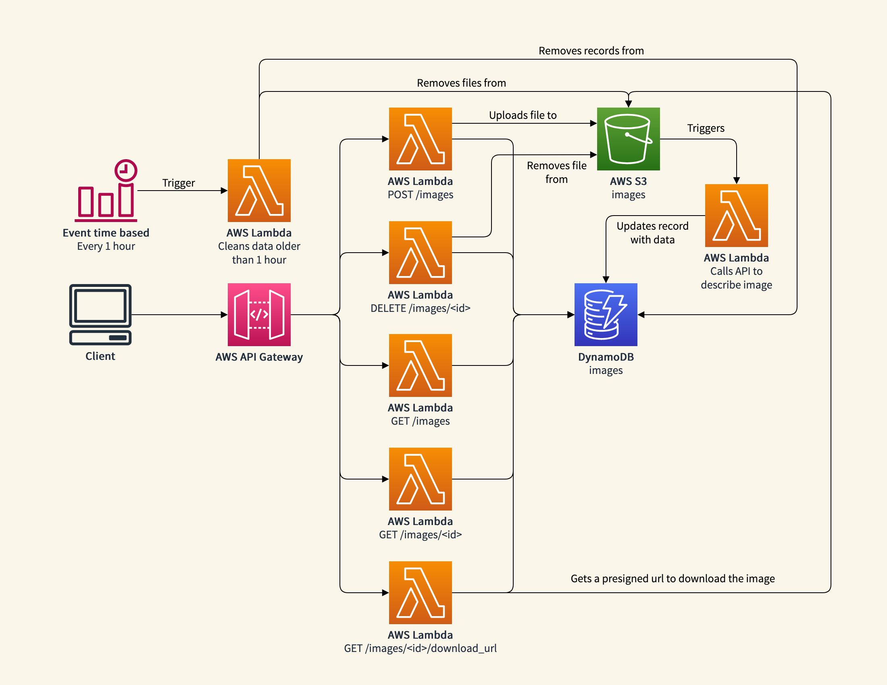

# Building serverless applications in Python with AWS Chalice

We will build an application to get the concepts (tags) of an image using AI. We will use an external API to get
the concepts. To achieve this, we will create a set of AWS Lambda functions. We wll need to
create an AWS Lambda function that takes an image an uploads it to a bucket (that was already created on S3) and
it will create a record on a DynamoDB table (that was already created).
Then, an AWS Lambda will be triggered (S3 object creation event) and it will use an [external API](https://docs.clarifai.com/api-guide/predict/images)
to get the images concepts, and it will update the DynamoDB record with the concepts. Also, we will have 4 additional
AWS Lambda functions: to get all, to get one, to delete one, and to get a presigned url to download the image from S3.
Finally, another AWS Lambda function will be created to clean the older images (older than 1 hour) and
it will be triggered periodically (every hour) using an event time (AWS EventBridge). The next image shows
the diagram of this application:



Check that you AWS credentials were already configured locally:
```bash
aws configure list --profile jdac
```

You need to create a Table in DynamoDB for this exercise. Let's call it `images`. To check if the table exists, execute:

```bash
aws dynamodb list-tables --profile jdac
```

You also need to have a bucket on S3 in order to store the images. Let's call it `images-jdac-mtt`. To check if the bucket already exists, execute:

```bash
aws s3 ls --profile jdac
```

Make sure the Python version is supported by AWS Lambda:

```bash
python3 --version
```

Install Chalice:

```bash
pip install chalice
```

Check the Chalice version:

```bash
chalice --version
```

Create a new project with Chalice:

```bash
chalice new-project images-descriptor
```

Install dependencies:

```bash
pip install -r requirements.txt
```

We are going to use the [Clarifai](https://clarifai.com/) API to get the image concepts (tags) using AI. You will
need to create an account in order [to create a PAT](https://docs.clarifai.com/clarifai-basics/authentication/personal-access-tokens)
(Personal Access token). Then, feel free to read [this documentation](https://docs.clarifai.com/api-guide/predict/images)
where you will find the endpoint documentation to get the tags of an image.

Do not forget to replace the `CLARIFI_PAT` environment variable in the `images-descriptor/.chalice/config.json` file
in order to be able to use the Clarifai API.
